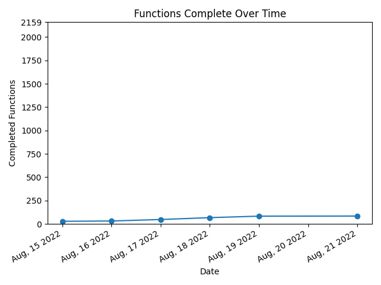

# ChameleonTwist2v1.0-JP

## Progress Info

## Building
git clone this repository in a WSL 2 directory

Requirements (for debian based systems only currently)
`./install.sh`

Place a vanilla japanese chameleon twist 2 rom (v1.0) in the root directory named `baserom.z64`

Run `make setup` to split the rom, then run `make -j` to build the rom
`make clean` will clean the asm/ assets/ and build/ directories
## Contributing
When Pushing run `cd tools` then `python3 create_repo_assets.py` to update the information and then push. REMEMBER to `cd ..` back to the root before pushing
